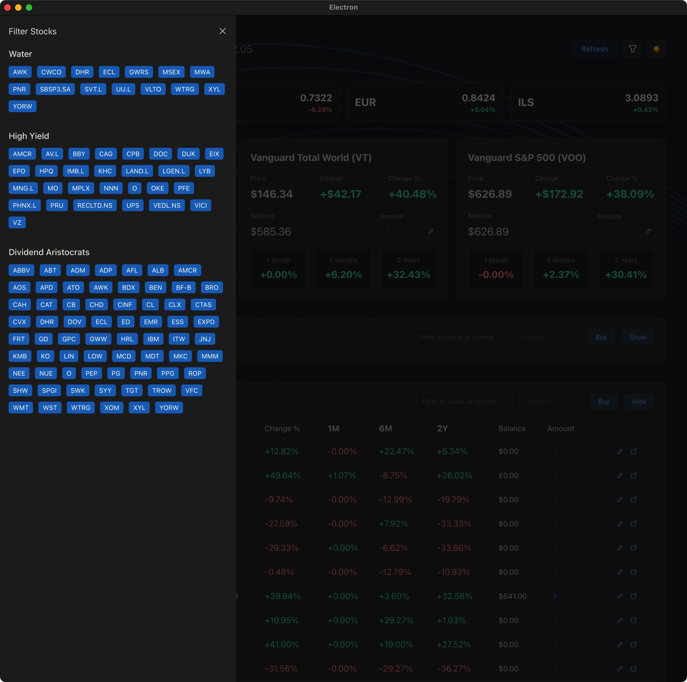
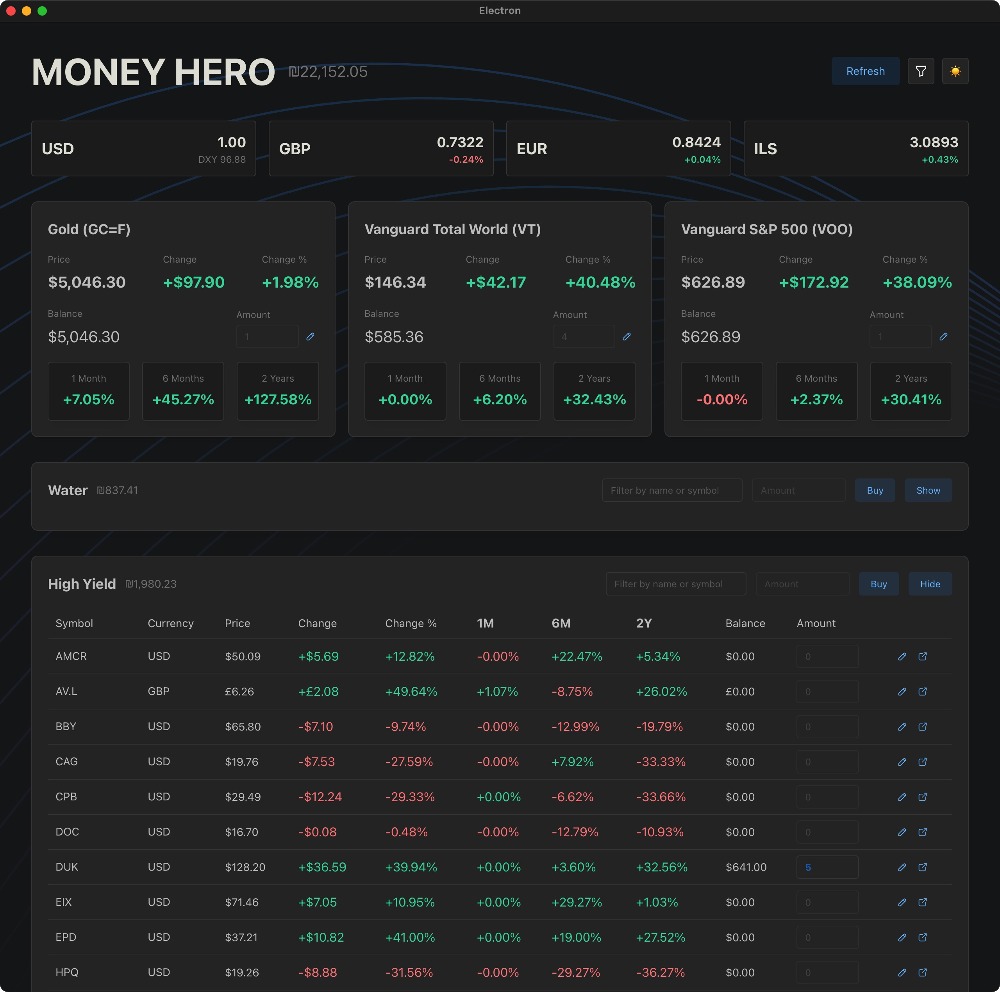
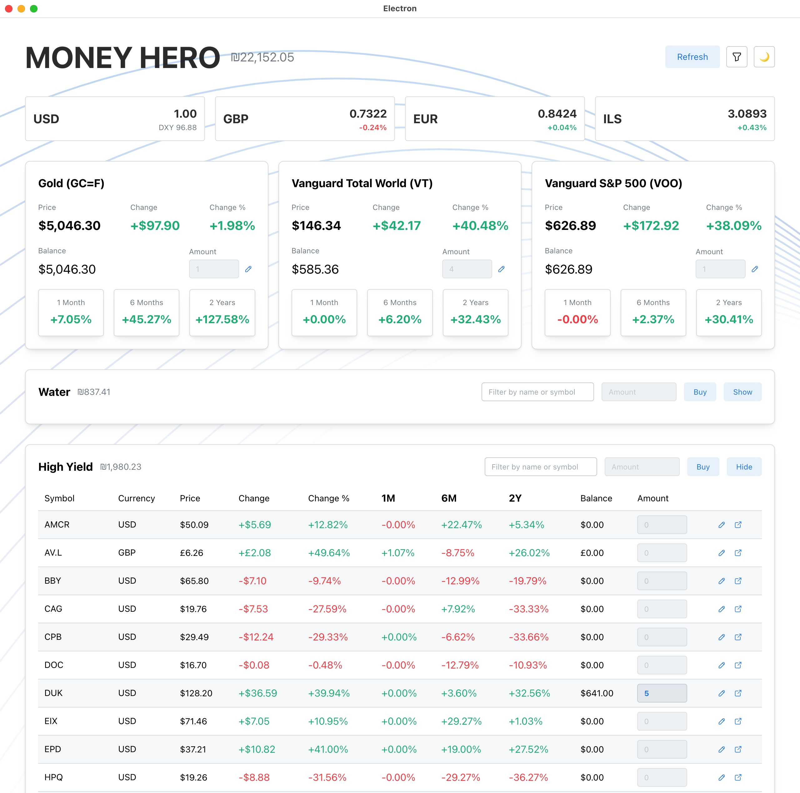

# Money Hero

A desktop investment dashboard that tracks gold, stocks, and currency exchange rates. Built with Electron, React, and TypeScript.

<table>
  <tr>
    <td></td>
    <td></td>
    <td></td>
  </tr>
  <tr>
    <td><em>Filter Stocks drawer</em></td>
    <td><em>Dark theme</em></td>
    <td><em>Light theme</em></td>
  </tr>
</table>

## Features

- **Gold Tracking** — Live gold futures price (GC=F) with daily change, historical performance (1M / 6M / 2Y), and portfolio balance based on your holdings
- **Stock Watchlists** — Three curated stock universes out of the box:
  - **Dividend Aristocrats** — S&P 500 companies with 25+ years of consecutive dividend increases
  - **High Yield** — Stocks selected for above-average dividend yields across US and international markets
  - **Water** — Companies in the water infrastructure, utilities, and treatment sector
- **Index Fund Widgets** — Dedicated cards for VWRA.L (Total World) and VOO (S&P 500) ETFs with price, change, and balance tracking
- **Currency Rates** — USD exchange rates for GBP, EUR, and ILS with daily change percentages and the US Dollar Index (DXY)
- **Portfolio Balance** — Aggregated total balance across all assets, converted to ILS
- **Buy Mode** — Enter an investment amount and see how it would be allocated across stocks in a watchlist
- **Sortable & Filterable Tables** — Sort stocks by 1M / 6M / 2Y performance, filter by name or symbol
- **Editable Holdings** — Set the number of shares you own per symbol; balances update automatically
- **Dividend Yield** — Annualized dividend yield calculated from historical dividend events
- **Local Database** — All quotes and holdings are cached in a local SQLite database for instant startup
- **Auto-Refresh** — Data refreshes automatically every 20 minutes with a sequential fetch queue and rate limiting
- **Dark / Light Theme** — Toggle between color schemes with a single click
- **Cross-Platform** — Builds for macOS, Windows, and Linux

## Tech Stack

| Layer       | Technology                                                                                   |
| ----------- |----------------------------------------------------------------------------------------------|
| Framework   | [Electron](https://www.electronjs.org/) with [electron-vite](https://electron-vite.org/)     |
| UI          | [React 19](https://react.dev/) + [Mantine 8](https://mantine.dev/)                           |
| State       | [MobX](https://mobx.js.org/) (class-based stores)                                            |
| Language    | [TypeScript 5](https://www.typescriptlang.org/)                                              |
| Database    | [better-sqlite3](https://github.com/WiseLibs/better-sqlite3) via [Knex](https://knexjs.org/) |
| Validation  | [Zod 4](https://zod.dev/) (standard in main process, `zod/mini` in preload)                  |
| Data Source | [Yahoo Finance](https://finance.yahoo.com/) Chart API                                        |
| Linting     | [@miskamyasa/eslint-config](https://github.com/miskamyasa/eslint-config) (no Prettier)       |
| Build       | [electron-builder](https://www.electron.build/)                                              |

## Prerequisites

- **Node.js** 24
- **Yarn** 4 (via Corepack)

Exact versions are pinned in `mise.toml`. If you use [mise](https://mise.jdx.dev/), run `mise install` to set them up automatically — the `postinstall` hook enables Corepack and activates the correct Yarn release.

## Getting Started

```bash
# Install dependencies
yarn install

# Start the development server
yarn dev
```

## Scripts

| Command            | Description                                     |
| ------------------ | ----------------------------------------------- |
| `yarn dev`         | Start Electron in development mode with HMR     |
| `yarn build`       | Type-check and build for production             |
| `yarn start`       | Preview the production build                    |
| `yarn lint`        | Run ESLint (with cache)                         |
| `yarn lint:fix`    | Run ESLint and auto-fix issues                  |
| `yarn typecheck`   | Run TypeScript type-checking for both processes |
| `yarn build:mac`   | Build a distributable for macOS                 |
| `yarn build:win`   | Build a distributable for Windows               |
| `yarn build:linux` | Build a distributable for Linux                 |

## Architecture

The app follows the standard three-process Electron architecture:

```
src/
├── main/              # Main process — Node.js, IPC handlers, database, API fetchers
│   └── schemas/       # Zod schemas for Yahoo Finance API responses
├── preload/           # Preload scripts — IPC bridge with payload validation
├── shared/            # Types, schemas, and constants shared across all processes
│   └── schemas/       # Zod Mini schemas for IPC domain types
└── renderer/src/      # Renderer process — React UI
    ├── components/    # React components (GoldStats, StocksTable, CurrencyRates, etc.)
    ├── config/        # Static configuration (stock symbol lists)
    ├── stores/        # MobX stores (RootStore, GoldStore, CurrencyStore, etc.)
    └── utils/         # Helpers (formatting, notifications)
```

- **Main process** fetches data from Yahoo Finance, manages the SQLite database, and exposes IPC handlers.
- **Preload script** bridges main and renderer with a typed `window.api` object; all IPC payloads are validated with Zod before reaching the renderer.
- **Renderer** is a React SPA using MobX for state management and Mantine for the component library.

## License

This project is licensed under the **GNU General Public License v3.0** — see the [LICENSE](LICENSE) file for details.
